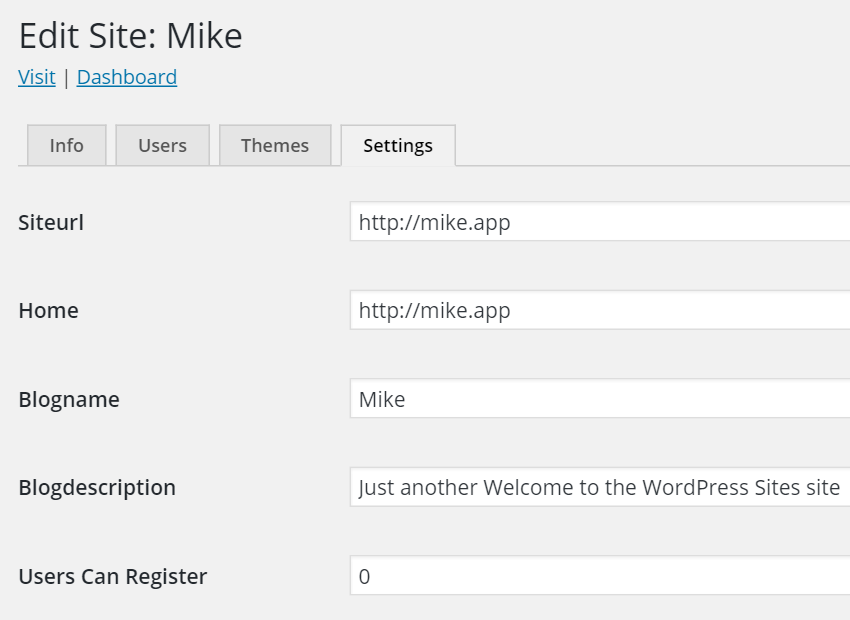

# Wordpress-multisite

wp-cli 
```
cd /var/www/html/

mkdir wordpress

cd !$

wp core install

wp core multisite-install --title="Welcome to the WordPress" --admin_user="admin" --admin_password="password" --admin_email="mij@llgc.org.uk" --url="http://dev.app"
```


.htaccess
```
RewriteEngine On
RewriteBase /
RewriteRule ^index\.php$ - [L]

# add a trailing slash to /wp-admin
RewriteRule ^([_0-9a-zA-Z-]+/)?wp-admin$ $1wp-admin/ [R=301,L]

RewriteCond %{REQUEST_FILENAME} -f [OR]
RewriteCond %{REQUEST_FILENAME} -d
RewriteRule ^ - [L]
RewriteRule ^([_0-9a-zA-Z-]+/)?(wp-(content|admin|includes).*) var/www/html/$2 [L]
RewriteRule ^([_0-9a-zA-Z-]+/)?(.*\.php)$ var/www/html/$2 [L]
RewriteRule . index.php [L]
```

Apache - /etc/apache2/sites-available/10-default_vhost_80.conf

```
 Alias /adminer  /var/www/html/adminer/
 Alias /site    /var/www/html/site/
 Alias /pcw-microsite    /var/www/html/pcw-microsite/
 Alias /generate /var/www/html/generate/
 Alias / /var/www/html/wordpress/

 <VirtualHost *:80>
   ServerName default


   ## Vhost docroot
   DocumentRoot "/var/www/html/"

   ## Directories, there should at least be a declaration for /var/www/html

   <Directory "/var/www/html/">
     Options Indexes FollowSymlinks MultiViews
     AllowOverride All
     Require all granted

     <FilesMatch "\.php$">
       Require all granted
       SetHandler proxy:fcgi://127.0.0.1:9000
     </FilesMatch>

   </Directory>

   ## Logging
   ErrorLog "/var/log/apache2/default_vhost_80_error.log"
   ServerSignature Off
   CustomLog "/var/log/apache2/default_vhost_80_access.log" combined

   ## Custom fragment

 </VirtualHost>
```

wp-config
```
define('WP_DEBUG', false);

define( 'WP_ALLOW_MULTISITE', true );
define( 'MULTISITE', true );
define( 'SUBDOMAIN_INSTALL', false );
$base = '/wordpress/';
define( 'DOMAIN_CURRENT_SITE', 'dev.app' );
define( 'PATH_CURRENT_SITE', '/' );
define( 'SITE_ID_CURRENT_SITE', 1 );
define( 'BLOG_ID_CURRENT_SITE', 1 );/* That's all, stop editing! Happy blogging. */

/** Absolute path to the WordPress directory. */
if ( !defined('ABSPATH') )
	define('ABSPATH', dirname(__FILE__) . '/');

/** Sets up WordPress vars and included files. */
require_once(ABSPATH . 'wp-settings.php');
```

Database - wp_options
```
siteurl : http://dev.app/
home: http://dev.app/
```

Hosts File - Local (Windows)
```
192.168.56.101	dev.app
192.168.56.101	mike.app
192.168.56.101	foo.dev
```

Worpdress Site admin

